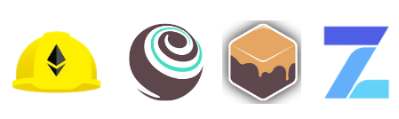

---

### Hello! I'm Lian, a senior fullstack and blockchain developer

Technology I like to use:

My first choice for web development and DeFi apps.

**Python, Keras, Anaconda, TensorFlow**

**Hardhat, Truffle, Ganache, OpenZeppelin**

**Jenkins, Mocha, Jest, PyTest**

---

## About Me

I am a punctuated and solution oriented fullstack engineer. And also, I am ambitious, organized and detail oriented. I have over 10 years of experience in software design and development. I am strong at Ecommerce, Fintech, Blockchain, DeFi, Machine learning technologies. And, have some experience with data visualization.

My key skills are creative thinking and excellent algorithms.
I like to play key Developer and Software Architect roles, and sometimes I also play the roles of Team Lead, Project Coordinator, Code Reviewer or Auditor.

Contact me on Telegram [@prodev02](https://t.me/prodev02) or discord `liandev#3375` if you have a cool project. Let's chat!
